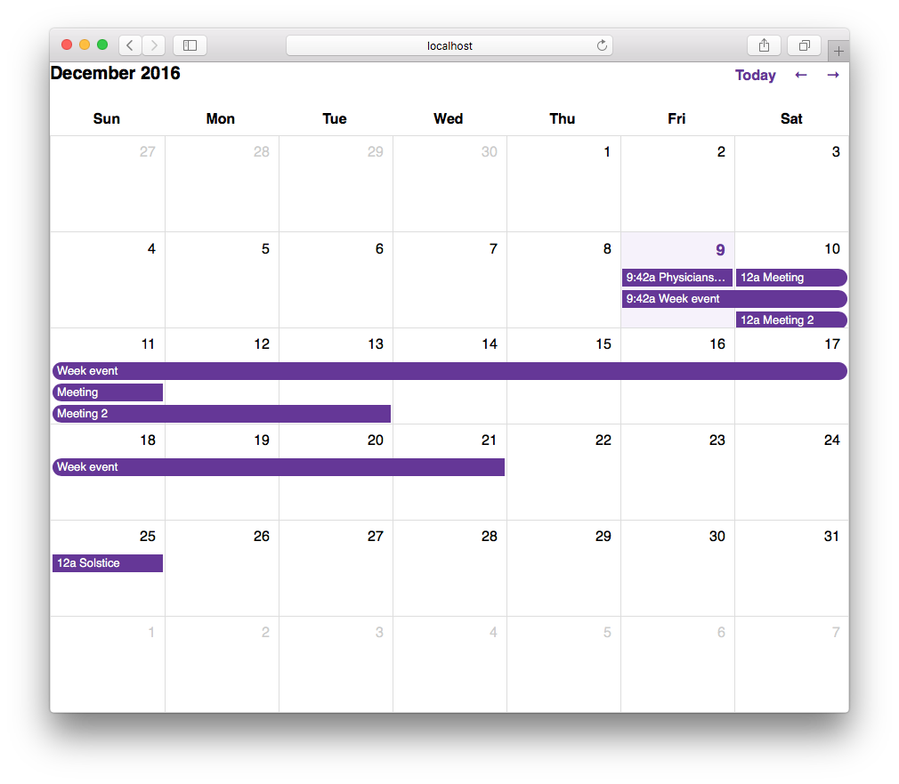

# Calendar

A simple calendar to render months with events.



## Basic usage

```javascript
var calendar = new Calendar(document.getElementById('calendar'));
calendar.render();
```

## Rendering events

```javascript
var calendar = new Calendar(document.getElementById('calendar'));
calendar.render(new Date(), [
  {
    title: 'Today!',
    start_date: new Date(),
    end_date: new Date()
  },
  {
    title: "Beer O'clock",
    start_date: new Date('April 3, 2015'),
    end_date: new Date('April 6, 2015')
  }
]);
```

## Development

* `npm install`
* `npm start`

* `npm run` to list available tasks or peek at package.json

## Specs

* `npm test`
* `karma start` to run tests in browsers
